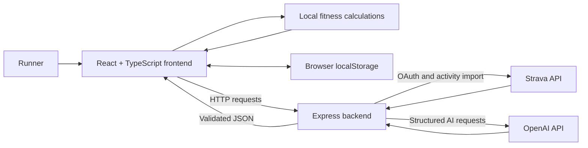

# Race Readiness AI

Race Readiness AI is a full-stack running dashboard that explains a runner's current fitness, training load, race capability, and preparation needs.

The app combines Strava activity history, deterministic fitness calculations, race-tagged performances, and structured AI coaching.

## What It Does

- Displays a running fitness dashboard
- Calculates weekly distance, longest run, number of runs, and training load
- Switches all displayed distance, pace, elevation, plan, and AI-summary values between miles and kilometers
- Charts 14 weeks of fitness, fatigue, and form with fresh, optimal, and high-risk zones
- Estimates race potential for:
  - 5K
  - 10K
  - Half Marathon
  - Marathon
- Automatically uses Strava race-tagged activities as race data
- Shows current race capability estimates from imported race history
- Lets the user select a goal race and goal race date
- Uses AI to generate a coaching-style summary
- Imports real activity data from Strava
- Generates AI activity analysis, weekly check-ins, and race training plans
- Builds training plans around the runner's Strava baseline, preferred run frequency, rest day, long-run day, and goal
- Highlights strengths, risks, and suggestions

## Tech Stack

- React
- TypeScript
- Vite
- CSS
- Node.js
- Express
- OpenAI API

## Why I Built This

I built this project to practice building a full-stack application with a real use case.

The goal was to combine:

- frontend UI design
- backend API logic
- running data analysis
- race prediction calculations
- AI-generated insights

This project is also a foundation for a future Strava-connected app.

## Current Features

### Fitness Dashboard

The dashboard shows:

- Weekly distance
- Longest run
- Runs this week
- Exponentially weighted 42-day fitness, 7-day fatigue, form, ramp rate, and training status
- Fitness score
- Current race capability
- A 14-week connected fitness/fatigue/form chart
- A saved miles/kilometers display preference

### Race Prediction

Race-tagged Strava activities are used automatically. Manual race data is used as a fallback.

Example:

```text
Past race: 5K
Past time: 22:30
Goal race: Half Marathon
```

The app estimates equivalent current race capabilities from the strongest imported race performances.

### AI Summary

The AI summary uses the runner's current data to generate:

- A headline
- A short fitness summary
- An AI-adjusted goal time
- A confidence level
- Strengths
- Risks
- Suggestions

Distances in AI summaries are normalized after generation. The selected unit is
shown first, with the equivalent second unit when useful, for example:

```text
36.4 km (22.6 mi)
```

### Training Plans

The plan generator:

- Uses the stronger sustained baseline from the 90-day and latest 6-week Strava trends
- Respects the selected number of running days
- Uses an 80/20-style structure with mostly easy running
- Schedules a weekly long run and limited quality work
- Adds genuine recovery weeks, tapering, and race week
- Converts plan distances safely between miles and kilometers for display and editing

## Architecture

Race Readiness AI has two main parts:

1. The React frontend displays the dashboard and calculates immediate fitness metrics.
2. The Express backend securely communicates with Strava and OpenAI.

The browser never receives the Strava client secret or OpenAI API key.



### Data Flow

The normal data flow is:

```text
Strava or imported JSON
  -> validated Run objects
  -> fitness and race calculations
  -> dashboard, calendar, and activity details
  -> optional AI request
  -> validated AI response
  -> coaching summary or training plan
```

### Frontend Responsibilities

`src/App.tsx` is currently the main frontend controller. It:

- Stores runs, race goals, selected activities, and generated plans in React state
- Imports Strava activities through the backend
- Calculates 7-day, 42-day, and 90-day training metrics
- Displays activities, calendar months, heart-rate zones, load charts, and training plans
- Requests AI summaries, activity analysis, weekly check-ins, and training plans
- Saves imported runs, distance-unit preference, plan preferences, edited plans, and configured maximum heart rate in browser storage

`src/utils/fitnessCalculations.ts` contains deterministic calculations. These calculations run without AI and include:

- Fitness score
- Training load using 42-day fitness and 7-day fatigue exponential curves, plus form and ramp rate
- Race-time predictions using recent race-tagged performances
- Fourteen-week fitness, fatigue, and form history

### Backend Responsibilities

`server.js` is the Express API server. It:

- Keeps secret API credentials on the server
- Handles Strava OAuth and activity imports
- Converts Strava data into the app's shared `Run` format
- Sends structured prompts to OpenAI
- Validates AI responses before returning them to the frontend
- Applies deterministic safety rules after AI training-plan generation

Important backend routes:

| Route | Purpose |
| --- | --- |
| `GET /api/strava/connect` | Starts Strava authorization |
| `GET /api/strava/callback` | Completes Strava authorization and shows the refresh token for `.env` |
| `GET /api/strava/runs` | Imports and normalizes Strava runs |
| `POST /api/ai-summary` | Generates the overall fitness summary |
| `POST /api/activity-insight` | Analyzes one selected activity |
| `POST /api/coach-check-in` | Generates a weekly coaching check-in |
| `POST /api/training-plan` | Generates and normalizes a race training plan |

### AI Safety Boundary

AI generates explanations and proposes plans, but it does not control every calculation.

- Race predictions begin with deterministic race formulas.
- Imported data and AI responses are validated before use.
- The training-plan normalizer enforces mileage progression, long-run limits, recovery weeks, taper timing, and final race week.
- The AI-summary normalizer removes contradictory advice and verifies unit conversions.
- Missing information, such as weather data, is reported as missing instead of being invented.

## Project Structure

```text
race-readiness-ai/
  src/
    components/
      RacePrediction.tsx
      RunCard.tsx
      StatCard.tsx
    data/
      sampleRuns.ts
    utils/
      aiCoachSummary.ts
      dateUtils.ts
      fitnessCalculations.test.ts
      fitnessCalculations.ts
    App.tsx
    index.css
    main.tsx
  server.js
  package.json
  README.md
```

## How to Run Locally

1. Clone the repository:

```bash
git clone https://github.com/AACoetzee/race-readiness-ai.git
```

2. Go into the project folder:

```bash
cd race-readiness-ai
```

3. Install dependencies:

```bash
npm install
```

4. Create an environment file.

Create a file called `.env` in the main project folder and add your API credentials:

```bash
OPENAI_API_KEY=your_api_key_here
STRAVA_CLIENT_ID=your_client_id
STRAVA_CLIENT_SECRET=your_client_secret
STRAVA_REFRESH_TOKEN=your_refresh_token
STRAVA_REDIRECT_URI=http://localhost:3001/api/strava/callback
```

Do not commit this file to GitHub.

5. Start the backend server:

```bash
npm run server
```

The backend runs at:

```text
http://localhost:3001
```

6. Start the React app.

Open a second terminal and run:

```bash
npm run dev
```

The frontend runs at:

```text
http://localhost:5173
```

## Available Scripts

```bash
npm run dev
```

Starts the React frontend.

```bash
npm run server
```

Starts the Express backend.

```bash
npm run build
```

Builds the app for production.

```bash
npm run preview
```

Previews the production build.

## Environment Variables

This project uses the OpenAI and Strava APIs.

Create a `.env` file:

```bash
OPENAI_API_KEY=your_api_key_here
STRAVA_CLIENT_ID=your_client_id
STRAVA_CLIENT_SECRET=your_client_secret
STRAVA_REFRESH_TOKEN=your_refresh_token
STRAVA_REDIRECT_URI=http://localhost:3001/api/strava/callback
```

Use `/api/strava/connect` to authorize your Strava account and copy the returned `STRAVA_REFRESH_TOKEN` into `.env`.

Important:

- Never commit `.env`
- Never put API keys directly in frontend code
- Keep secrets on the backend only

## Importing Strava Runs

1. Start the backend with `npm run server`.
2. Start the frontend with `npm run dev`.
3. If needed, open `http://localhost:3001/api/strava/connect` and approve Strava.
4. Copy the returned `STRAVA_REFRESH_TOKEN` into `.env`.
5. Restart the backend.
6. Click **Import Strava**.

The app imports runs from the Strava account represented by the refresh token in `.env`.

## Deployment Notes

To deploy this as a login-based Strava app, host both pieces:

- The Express backend, which owns Strava/OpenAI secrets and OAuth callbacks.
- The built React frontend, which is served by the Express backend in production.

Suggested production commands:

```bash
npm install
npm run build
npm start
```

Production environment variables:

```bash
OPENAI_API_KEY=your_api_key_here
STRAVA_CLIENT_ID=your_client_id
STRAVA_CLIENT_SECRET=your_client_secret
STRAVA_REFRESH_TOKEN=your_refresh_token
STRAVA_REDIRECT_URI=https://your-app-domain.com/api/strava/callback
CLIENT_ORIGIN=https://your-app-domain.com
VITE_API_BASE_URL=
```

In the Strava developer dashboard, set the authorization callback domain to your deployed app domain. The callback route must match `STRAVA_REDIRECT_URI`.

## Current Limitations

This is an early version. It includes sample data and can import live Strava data.

The race predictions are estimates and should not be treated as guaranteed race outcomes.

The AI summary is meant to explain the data and provide general training insight. It is not medical advice.

Weather analysis depends on whether weather fields are available in the imported activity.

## Future Improvements

Planned improvements:

- Add pace trend charts
- Improve race prediction logic
- Add user authentication
- Save athlete profiles
- Add deployment

## Notes

This project uses deterministic calculations and race-tagged performances as the factual starting point, then uses AI to explain the data and propose training.

The formula gives a baseline estimate.

The AI helps explain whether that estimate seems realistic based on training load, long run distance, consistency, and goal race timing.
