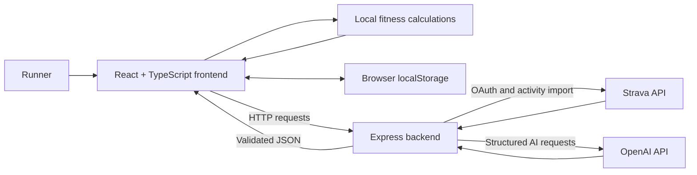

# Race Readiness AI

Race Readiness AI is a full-stack running dashboard that estimates a runner's current fitness and race potential.

The app uses sample running data, race prediction formulas, and an AI-generated coaching summary to help explain a runner's strengths, risks, and possible race outcomes.

## What It Does

- Displays a running fitness dashboard
- Calculates weekly mileage, longest run, number of runs, and training load
- Estimates race potential for:
  - 5K
  - 10K
  - Half Marathon
  - Marathon
- Lets the user enter a past race distance and time
- Uses a race prediction formula to estimate future race times
- Lets the user select a goal race and goal race date
- Uses AI to generate a coaching-style summary
- Imports real activity data from Strava
- Generates AI activity analysis and training plans
- Highlights strengths, risks, and suggestions

## Tech Stack

- React
- TypeScript
- Vite
- CSS
- Node.js
- Express
- OpenAI API

## Why I Built This

I built this project to practice building a full-stack application with a real use case.

The goal was to combine:

- frontend UI design
- backend API logic
- running data analysis
- race prediction calculations
- AI-generated insights

This project is also a foundation for a future Strava-connected app.

## Current Features

### Fitness Dashboard

The dashboard shows:

- Weekly mileage
- Longest run
- Runs this week
- Training load
- Fitness score

### Race Prediction

The app allows the user to enter a past race result.

Example:

```text
Past race: 5K
Past time: 22:30
Goal race: Half Marathon
```

The app then estimates race potential using a race prediction formula and training adjustments.

### AI Summary

The AI summary uses the runner's current data to generate:

- A headline
- A short fitness summary
- An AI-adjusted goal time
- A confidence level
- Strengths
- Risks
- Suggestions

## Architecture

Race Readiness AI has two main parts:

1. The React frontend displays the dashboard and calculates immediate fitness metrics.
2. The Express backend securely communicates with Strava and OpenAI.

The browser never receives the Strava client secret or OpenAI API key.



### Data Flow

The normal data flow is:

```text
Strava or imported JSON
  -> validated Run objects
  -> fitness and race calculations
  -> dashboard, calendar, and activity details
  -> optional AI request
  -> validated AI response
  -> coaching summary or training plan
```

### Frontend Responsibilities

`src/App.tsx` is currently the main frontend controller. It:

- Stores runs, race goals, selected activities, and generated plans in React state
- Imports Strava activities through the backend
- Calculates 7-day, 42-day, and 90-day training metrics
- Displays activities, calendar months, heart-rate zones, load charts, and training plans
- Requests AI summaries, activity analysis, weekly check-ins, and training plans
- Saves plan preferences, edited plans, and configured maximum heart rate in browser storage

`src/utils/fitnessCalculations.ts` contains deterministic calculations. These calculations run without AI and include:

- Fitness score
- Training load, fatigue, fitness, form, and ramp rate
- Race-time predictions using recent race-tagged performances
- Eight-week load history

### Backend Responsibilities

`server.js` is the Express API server. It:

- Keeps secret API credentials on the server
- Handles Strava OAuth and activity imports
- Converts Strava data into the app's shared `Run` format
- Sends structured prompts to OpenAI
- Validates AI responses before returning them to the frontend
- Applies deterministic safety rules after AI training-plan generation

Important backend routes:

| Route | Purpose |
| --- | --- |
| `GET /api/strava/connect` | Starts Strava authorization |
| `GET /api/strava/callback` | Completes Strava authorization |
| `GET /api/strava/runs` | Imports and normalizes Strava runs |
| `POST /api/ai-summary` | Generates the overall fitness summary |
| `POST /api/activity-insight` | Analyzes one selected activity |
| `POST /api/coach-check-in` | Generates a weekly coaching check-in |
| `POST /api/training-plan` | Generates and normalizes a race training plan |

### AI Safety Boundary

AI generates explanations and proposes plans, but it does not control every calculation.

- Race predictions begin with deterministic race formulas.
- Imported data and AI responses are validated before use.
- The training-plan normalizer enforces mileage progression, long-run limits, recovery weeks, taper timing, and final race week.
- Missing information, such as weather data, is reported as missing instead of being invented.

## Project Structure

```text
race-readiness-ai/
  src/
    components/
      RacePrediction.tsx
      RunCard.tsx
      StatCard.tsx
    data/
      sampleRuns.ts
    utils/
      aiCoachSummary.ts
      dateUtils.ts
      fitnessCalculations.test.ts
      fitnessCalculations.ts
    App.tsx
    index.css
    main.tsx
  server.js
  package.json
  README.md
```

## How to Run Locally

1. Clone the repository:

```bash
git clone https://github.com/AACoetzee/race-readiness-ai.git
```

2. Go into the project folder:

```bash
cd race-readiness-ai
```

3. Install dependencies:

```bash
npm install
```

4. Create an environment file.

Create a file called `.env` in the main project folder and add your API credentials:

```bash
OPENAI_API_KEY=your_api_key_here
STRAVA_CLIENT_ID=your_client_id
STRAVA_CLIENT_SECRET=your_client_secret
STRAVA_REFRESH_TOKEN=your_refresh_token
```

Do not commit this file to GitHub.

5. Start the backend server:

```bash
npm run server
```

The backend runs at:

```text
http://localhost:3001
```

6. Start the React app.

Open a second terminal and run:

```bash
npm run dev
```

The frontend runs at:

```text
http://localhost:5173
```

## Available Scripts

```bash
npm run dev
```

Starts the React frontend.

```bash
npm run server
```

Starts the Express backend.

```bash
npm run build
```

Builds the app for production.

```bash
npm run preview
```

Previews the production build.

## Environment Variables

This project uses the OpenAI and Strava APIs.

Create a `.env` file:

```bash
OPENAI_API_KEY=your_api_key_here
STRAVA_CLIENT_ID=your_client_id
STRAVA_CLIENT_SECRET=your_client_secret
STRAVA_REFRESH_TOKEN=your_refresh_token
```

Important:

- Never commit `.env`
- Never put API keys directly in frontend code
- Keep secrets on the backend only

## Current Limitations

This is an early version. It includes sample data and can import live Strava data.

The race predictions are estimates and should not be treated as guaranteed race outcomes.

The AI summary is meant to explain the data and provide general training insight. It is not medical advice.

Weather is not currently imported, so activity analysis reports weather as unavailable instead of guessing.

## Future Improvements

Planned improvements:

- Add weekly mileage trends
- Add pace trend charts
- Add weather data to activity analysis
- Improve race prediction logic
- Add user authentication
- Save athlete profiles
- Add deployment

## Notes

This project uses a science-based race prediction formula as a starting point, then uses AI to provide context around the estimate.

The formula gives a baseline estimate.

The AI helps explain whether that estimate seems realistic based on training load, long run distance, consistency, and goal race timing.
